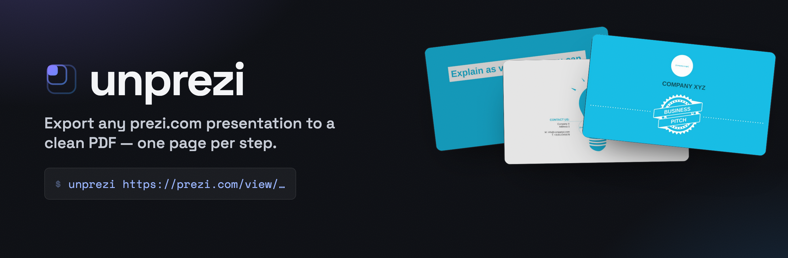
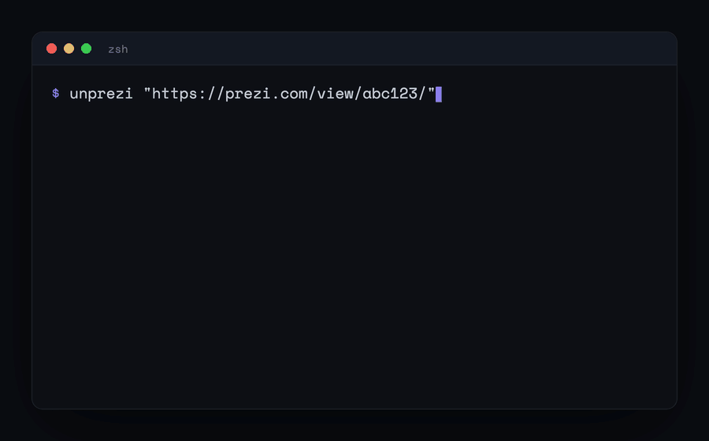

<p align="center">
  
</p>

<p align="center">
  <a href="LICENSE"></a>
  
  
</p>

# unprezi

Export a prezi.com presentation to a PDF. It opens the presentation in a headless
browser, steps through the whole path, and saves each stop as a page. Works on
today's `prezi.com/view/` share links, and you don't need a Prezi Plus/Pro account.

<p align="center">
  
</p>

## Why this exists

I needed to get a Prezi out as a PDF and reached for [prezi2pdf](https://github.com/Gertje823/prezi2pdf),
the tool everyone links to. It doesn't work anymore. Prezi locked down the
storyboard API it pulled slides from, so now it just 403s. A few open issues on
that repo are people hitting the same wall.

So unprezi takes the other route. Instead of asking Prezi's API for the slides,
it watches the presentation play: open it in a browser, press the arrow key,
screenshot the canvas at every step, stitch the frames into a PDF. Slower than an
API call, but it survives whatever Prezi changes on their backend, because the one
thing it leans on is the presentation playing in a tab.

## Install

```bash
pip install git+https://github.com/jasp-nerd/unprezi
playwright install chromium
```

The second line is a one-time download of the browser Playwright drives (~150 MB).

## Use it

```bash
unprezi "https://prezi.com/view/XXXXXXXXXXXXXXXX/"
```

That writes `<presentation-title>.pdf` next to you. The URL is the share link you
get from Prezi's "Share" button, or just the address bar while you're viewing one.

Common flags:

| Flag | What it does |
| --- | --- |
| `-o out.pdf` | Pick the output path. |
| `--jpeg-quality 82` | Recompress pages as JPEG. Much smaller PDF, slightly softer. |
| `--png -o frames/` | Write one PNG per step instead of a PDF. |
| `--scale 3` | Render sharper (default is 2). Use it if text looks soft. |
| `--delay 2.5` | Fixed wait per step instead of auto-detecting. Bump it if a frame looks caught mid-zoom. |
| `--headed` | Show the browser so you can watch it work. |

Full list: `unprezi --help`.

## What you get

One page per stop along the presentation path, at the resolution the viewer
renders. Prezis zoom back out to a section overview between topics, and those
overview frames are real stops on the path, so they land in the PDF too. You get
the presentation the way it plays, not a guess at where the slide boundaries are.

## What it can't do

- It captures each step **after** it settles, so zoom animations and transitions
  don't carry into a static PDF. You keep the frames, without the motion between them.
- Embedded video and audio become a still image of wherever they were paused.
- Timing is a best guess. unprezi waits for each step to stop moving before it
  shoots, but a heavy step can still get caught mid-zoom. `--delay` is the knob
  for that.
- Older "classic" Prezis (the `prezi.com/<id>/<title>/` ones) work, but their
  canvas renders smaller, so bump `--scale` if you want them crisp.

## FAQ

**Do I need a paid Prezi account?** No. If you can open the link, unprezi can
export it.

**How is this different from prezi2pdf?** prezi2pdf asked Prezi's storyboard API
for pre-rendered slide images. That API is locked down now, so it fails on
current links. unprezi screenshots the live presentation instead, which is why it
still works.

**Why is it slow?** It plays the whole presentation in real time and waits for
each step to settle before shooting. A 40-step prezi takes a few minutes. That's
the trade for not depending on a private API.

**A frame came out mid-animation.** Raise `--delay` (e.g. `--delay 3`) so it
waits longer before each shot.

## Using it from Claude Code

There's a [Claude skill](skill/unprezi) in here too. Drop the `skill/unprezi`
folder into your skills directory and Claude can export a Prezi for you, either by
running this CLI or by driving its own Playwright browser the same way when the
CLI isn't installed.

## A note on use

unprezi is for getting presentations out that you have the right to: your own
talks, or public ones you want to read offline. It only sees what's already
visible from a share link; it doesn't get past logins or private content. Respect
the author's work and [Prezi's terms](https://prezi.com/terms-of-use/), and don't
pass off someone else's presentation as your own.

## Credit

Built in the spirit of [prezi2pdf](https://github.com/Gertje823/prezi2pdf) by
Gertje823, which is what got people exporting Prezis in the first place. Different
approach under the hood, same goal.

## License

[MIT](LICENSE).
